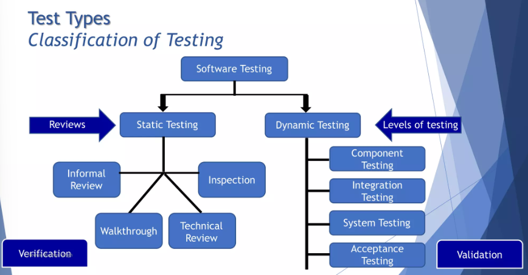

# TỔNG LƯỢC - ÔN TẬP NHANH VỀ SOFTWARE TESTING - SWT301

# Chapter 1 - Fundamentals of Testing
[slice chap 1 ISQB fundamentals](https://www.slideshare.net/jannatindia/chapter-1-fundamentals-of-testing-151245971)
## 1. ĐỊNH NGHĨA VỀ KIỂM THỬ PHẦN MỀM
- là so sánh giữa expected value và actual value, App xử lí, hành xử, thiết kế, chạy như tính toán, dự kiến hay không 
- là đối chiếu xem App có đc thiết kế, cài đặt, code như đã hứa hay không ? lời hứa về làm app, về tính năng của App nằm trong document tên là 
    + SRS (Software Requirements Specification)
    + FRS (Functional Requirements Specification)
- là so sánh, đo lường xem hiệu năng vận hành, trải nghiệm App có ổng như đã hứa hay không - chính là kiểm thử Non-functional reqs

## 2. 7 VIÊN NGỌC RỒNG - 7 NGUYÊN LÍ KIỂM THỬ - 7 PRINCIPLES OF SWT 
- giúp định hướng, dẫn đường cho các hoạt động kiểm thử phần mềm 
- cho mình biết rằng kiểm thử là tìm lỗi chứ không phải ...
- UAT là cực kì quan trọng, khách hàng hài lòng mới là ...
- Nghịch lí thuốc trừ sâu, coi chừng dân QC sơ sót đẻ lại nhiều bug không đc tìm thấy 

# Chapter 2 - Testing Throughout the Development LifeCycle
[slice chap 2 ISQB fundamentals](https://www.slideshare.net/jannatindiachapter-2-testing-throughout-the-development-lifecycle)

## 1. LEVEL OF TESTING - CÁC MỨC ĐỘ KIỂM THỬ
- Tùy vào việc hoàn thành App, tùy mức độ viết code đến dâu, thì sẽ có tương ứng các hành động kiểm thử. Code đến đoạn/chặng nào đó 
- Có 4 mức độ hoàn thành App, 4 mức độ code, 4 mức đọ kiểm thử 
    + ### 3.1 COMPONENT TESTING LEVEL - KIỂM THỬ ĐƠN VỊ (unit, module, program, structure, code testing)
        - là ta tiến hành ngay các công việc kiểm thử ngay khi ta làm xong 1 hàm/ method/ class
        - phải đảm bảo code đúng ngay từ phần nhỏ nhất về code của  app
        - ta  có thể dùng thêm các framework để giúp kiểm thử Unit hiệu quả hơn, ví cụ JUnit, Testing, NUnit .... 
    + ### 3.2 INTEGRATION TESTING LEVEL  - KIỂM THỬ TÍCH HỢP 
        - Ngay khi ta lắp rap Code + UI + API + DB để hình thành nên 1 chức năng, 1 tính năng, 1 màn hình, có xử lí giúp cho user làm việc gì đó, ví dụ tính năng login, tạo mới đơn hàng 
        - Để test 1 tính năng chạy đúng hay sai, ta cần App (đang viết dở dang) và ta dùng: 
            + sức người - chạy = cơm , nhập info và app/tính năng/ màn hình nhấn nút cho app, cho tính năng nó chạy, và xem app có trả về kết quả như mong đợi hay không ?
                >> TEST MANUAL 
            + sức máy: ta viết những đoạn code nho nhở (dùng thư viện phụ trợ) để điều khiển máy tự động  nhập info vào app tự động nhấn nút, tự động lấy output trả về từ app 
                >> TEST AUTOMATION, ATOMATED TEST 
                NHỮNG ĐOẠN CODE TỰ ĐỘNG THAY QC THẬT ĐỂ TEST CHỨC NĂNG; 
                ĐƯỢC GỌI LÀ TEST SCRIPT (code selenium hôm bữa)
        #### 3.2.1 Component Integration Testing
        #### 3.2.2 System Integration Testing
    + ### 3.3 SYSTEM TESTING LEVEL - KIỂM THỬ HỆ THÔNG 
        - khi App đã hoàn chỉnh ở góc độ viết code, khi ráp UI + Code + API + db thành tất cả các tính năng; các tính năng hứa trong SRS đã dc viết xong, giờ test cách sử dụng
        các tính năng coi xủ lí của app, các tính năng chạy có như dự kiến hay không
        - Rất giống Integration Test, chỉ có điều là test nhiều chức năng hơn. có thể dùng Test Manual dùn sức người, hoặc Test Automation - viết các code test (test script) để tự động
        hóa quá trình tìm bug 
        - dùng Senlnium, Appium, Katalon, Telerik, Ranorex, Test Complete để tự động hóa quá trình kiểm thử app 
    + ### 3.4 ACCEPTANCE TESTING LEVEL  
        - App đã tạm ổn - theo góc nhìn của công ty phần mềm; bắt đầu đem app đi cho user/khách hàng/ người đặt hàng xài!!!
        - Tùy loại app thì cách đem khác nhau 
            + App generic: đưa lên mạng cho download: alpha, beta, preview, rc 
            + App custome , customized, bespoke: đem cài đặt trên cty đặt hàng, cho nhân viên, ai đó bên họ xài, dùng thử
        - Đưa cho user/customer/người đặt hàng xài thử, dùng thử, để lấy feedback; mọt khi họ thích, họ dùng UAT đã ngon 

## 2. TESTING TYPES - PHÂN LOẠI KIỂM THỬ 
    - là bàn về MỤC TIÊU của kiểm thử, cần kiểm thử, đo lường, điều gì ở app gọi là TESTING TYPES 
    - tùy mục tiêu kiểm thử khác nhau, thì có các types khác nhau 
    * ví dụ: tui cần test chức năng login coi chạy ổn không ???
      ổn: theo SRS login gồm: login = user/pass, FB, GM sai 5 lần khóa account !!! sai có suggest Reset , Sign-up
    * ví dụ: tui cần test chức năng tạo mới đơn hàng tại quầy 7-Eleven coi ổn không 
      ổn: SRS nói rằng Create an Order gồm 
       - Scan, nhập thông tin KHTT
       - Scan các món đồ mua qua barcode reader
       - gõ = tay nếu scan ko đc
       - in bill cho customer, bill cho nhà bếp (mua bánh bao, bắp)
       - thanh toán = ví, tiền mặt 

["TEST CHỨC NĂNG CHẠY ỔN KHÔNG"]() 
    >>> MỤC TIÊU LÀ ĐO 1 CHỨC NĂNG CHẠY CHÍNH XÁC KHÔNG 
["FUNCTIONAL TESTING"]() (ứng với functional reqs), (có thể bắt đầu từ khi code đã rap UI - giai đoạn Integration level)
    * Tui muốn biết trong giờ cao điểm khuyến mãi sập sàn, 30 phút đầu app có chịu nổi 10k user hay không ???
    >>> ĐO HIỆU NĂNG, ĐO TRẢI NGHIỆM XÀI APP, ĐO PHI CHỨC NĂNG
    
["NON-FUNCTIONAL TESTING"]() (ứng với non-functional reqs) 
    * hôm bữa, tui đã test xong các chức năng login, tạo mới đơn hàng, nhưng chưa tícch hợp phần tích điểm KHTT, bữa nay tích hợp thêm code tích điểm;
    vậy chắc hôm bữa app chạy ngon phần tạo mới đơn hàng bữa nay, app còn chạy ngon hay không ??? do code đã có thêm bớt!!! 
    cần phải test lại phần đã test hôm bữa, do chỉnh code cần phải test lại để biết nó vẫn còn ngon  test lại để khẳng định còn ngon không 
    
["CONFIRMATION TEST"]() 
---> xác nhận một lỗi đã được sửa chữa để đảm bảo rằng lỗi đó đã được khắc phục hoàn toàn và không còn tồn tại trong hệ thống. Nó giúp xác nhận rằng sửa chữa đã hoạt động đúng cách và không gây ra các vấn đề mới. 

["REGRESSION TEST"]() 
--> kiểm thử lại toàn hệ thống sau khi có hành động fix bug , tối ưu hóa , hay cập nhật 
--> mục tiêu của REGRESSION TEST đảm bảo thay đổi khi có sự thay đổi, không gây ra vấn đề mới 
--> thường sử dụng automated test

    GỌI CHUNG LÀ : CHANGE RELATED-TESTING --> re-testing 

["MAINTERNANCE TEST"]() 
    khi server, cấu hình phần cứng có thay đổi, khi nâng cấp thư viện hệ điều hành, liệu App có chạy ổn trên môi trường mới  >> cần phải test lại 

["Testing of Software Structure"]()
    

## 2.1. TESTING TYPES - Classification of testing 

- testing levels, Testing Types còn chung chung !! tức là chưa nói cụ thể hành động cần phải làm gì, làm thế nào để tìm bug, hay để chứng mình app ổn, tính năng
- testing Techniques mang ý nghĩa giúp QC/Tester, chỉ cho QC/Tester các cách thức cụ thể để tiến hành test app, cách thức cụ thể để tìm ra các test case, tình huống xài app, xài hàm!!!
    ### 4.1.1 STATIC TESTING 
    - là kĩ thuật, cách thức kiểm thử app mà ["không cần, chưa có App"]()
    - Nhớ nguyên lí "Early Testing", thì dân QC bật đèn/tiến hành kiểm thử ngay khi BA bắt đầu làm SRS. 
    BA sẽ phối hợp với QC/Tester để kiểm tra để review các tài liệu liên quan đến quá trình làm dự án, QC/tester sẽ cùng BA đánh giá các tài liệu SRS, FRS, diagram (Class, UC, Sequence, activity, ERD)
    SWR phối hợp với SWT có nhiều cách review khác nhau, ví dụ: 
        - ["Informal reviews"]()
        - ["walkthroughs"]() 
        - ["technical review"]()
        - ["inspection"]()
    ["đều phải đọc document, design, diagram, tìm sai sót nếu có trước khi, trong khi viết code"]()
    ### 4.1.2 DYNAMIC TESTING 
    - là kĩ thuật, cách thức, kiểm thử App nhưng ["cần chạy App mới test đc"]()
    - chủ đạo của việc kiểm thử là DYNAMIC TESTING, tức là cần có APP/CODE để test 
    - trong đây có 2 nhánh chính, nhỏ hơn 
        + ["WHITE-BOX TESTING, GLASS-BOX TESTING"]() - kiểm thử hộp trắng
            - hộp trắng/trong suốt: tui mua 1 cái đồng hồ đeo tay mặt trước và sau trong suốt, bằng kiếng ta có thể thấy các bánh răng, bánh đà nó chạy Case/thùng máy PC
            - Test mà xem code, tức là: nhìn code mà test hoặc đọc code 
            - Testing the system with knowledge of the ["internal workings of the code"](). This technique focuses on the structure and logic of the code.
        + ["BLACK-BOX TESTING"]() - kiểm thử hộp đen
            - Hộp đen: ta không thấy chi tiết bên trong. hầu hết mọi thứ quanh ta là hộp đen. đứng trước máy ATM rút tiền, nghe máy kêu, nhưng không biết bên trong ra sao, chỉ biết nhận tiền về!!! ATM là hộp đen 
            - không care code chạy ra sao, không care hậu trường app/code ra sao 
            - Testing the system based on its inputs and outputs without knowledge of the internal workings of the code. This technique focuses on the functionality of the system.

    CÓ CÁC KĨ THUẬT THIẾT KẾ TEST CASE CƠ BẢN SAU:
    1. EQUIVALENCE PARTITIONING - PHÂN VÙNG TƯƠNG ĐƯƠNG
    2. BOUNDARY VALUE ANALYSIS  - PHÂN TÍCH GIÁ TRỊ BIÊN
    3. DECISION TABLE           - BẢNG QUYẾT ĐỊNH 
    4. State Transition Testing  - KIỂM THỬ TRẠNG THÁI CỦA ĐỐI TƯỢNG
    5. USE CASE TESTING         - KIỂM THỬ
    

## 6. TESTING DOCUMENT 
- Liên quan đến làm dự án phầm mềm thì có rất nhiều loại document có thể xuất hiện, đi bên cạnh là source code 
- những document có thể có trong quá trình làm dự án phần mềm có thể bao gồm 
- hợp đồng viết phần mềm
- các tài liệu mà BA xin về từ cty khách hàng
- cái SRS có thể viết văn tự do hoặc theo chuẩn/ Template có sẵn đa phần các công ty sẽ viết SRS theo chuẩn có sẵn, mang tên là 
    + IEEE 830 (1998) (Hiệp hội điện tử máy tính hoa kì)
- Các tài liệu của dân QC liên quan đến các hoạt động kiểm thử 
    Test Plan: kế hoạch kiểm thử App : con người, máy móc, thiết bị, thời điểm, kiểm thử app 
    Test Case: những tình huống cần test ở 1 chức năng nào đó, 1 hàm đó thường có: input, process, output 
- Những Tài Liệu Kiểm thử này cũng viết theo chuẩn để đảm bảo đủ info và dễ dàng giao tiếp trong nhóm, chuẩn viết document cho phần kiểm thử, cho test case gọi là 
    + IEEE 829 (i triple )

HỌC CÁCH VIẾT TEST CASE ĐÚNG CHUẨN - ĐÚNG CHUẨN CHO UNIT TEST, INTEGRATION TEST, SYSTEM TEST -> CHỈNH LÀ 3 CÂU HỎI CỦA ĐỀ THI PE 

# Chapter 3 - Static Testing 
[slice chap 3 ISQB fundamentals](https://www.slideshare.net/jannatindia/chapter-3-static-testing)
